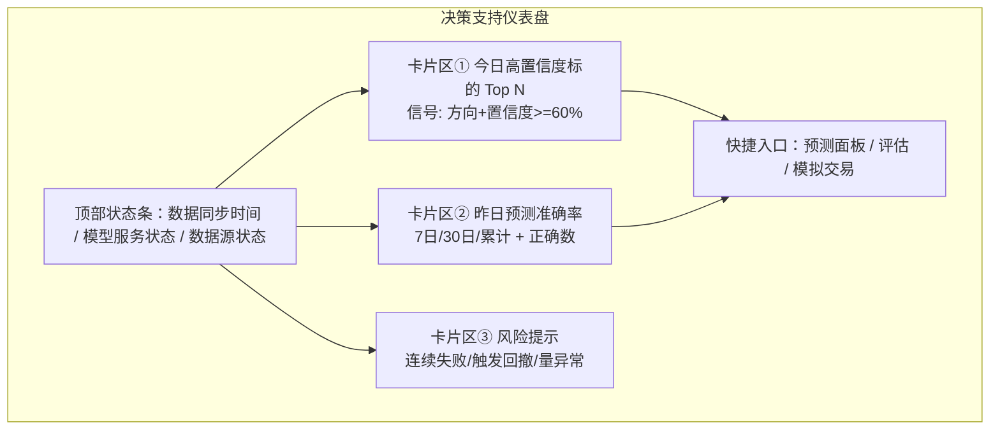
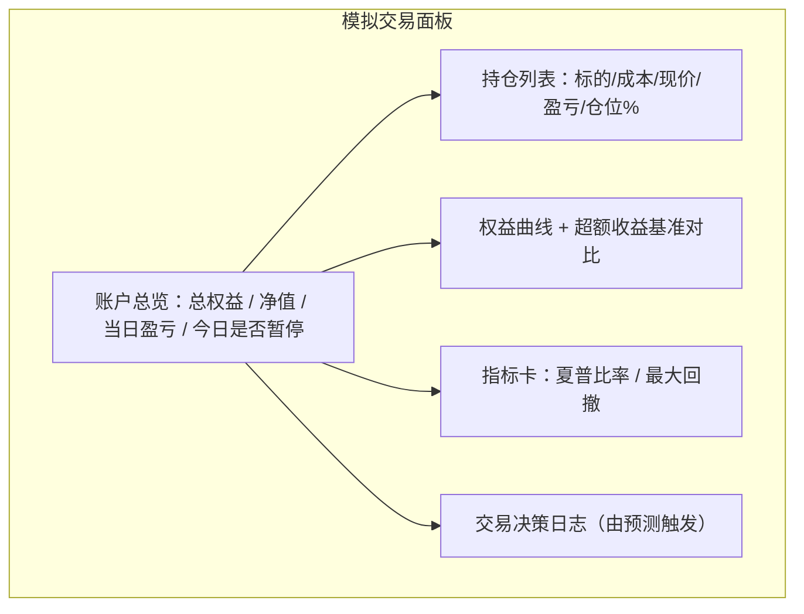

# 智能量化交易系统 — 需求文档（PRD）

> 创建日期：2026-08-25　版本：v0.1　状态：草案（待评审）
> 面向读者：研发、产品、量化研究/策略验证使用者

---

## 1. 需求背景

本项目已搭建完整的全栈基础设施：前端（React/Vite/TS）、后端网关（Go）、机器学习预测服务（Python FastAPI），以及 Redis / Kafka / PostgreSQL / TimescaleDB / MinIO 等中间件。当前系统已具备：全球多市场股票检索、实时行情（5 秒采集推送）、机器学习多周期预测、双轨交易（真实/模拟）、预测成功率自评估、数据采集回填与系统管理后台等模块。

**触发来源**：虽然各模块已存在，但尚未连成**一条可被信任的决策支持链路**——预测产出后无法自证其准确性，模拟交易未与预测联动形成"决策→执行→评估→修正"的闭环，导致系统对研究/策略验证用户的高价值产出有限。

**用户当前状态与痛点**：
- 行情与预测数据分散在各页面，缺少"今天该关注什么、该相信哪个预测"的统一出口；
- 预测方向与实际走势是否吻合没有直观可信的反馈，用户无法判断模型可信度；
- 模拟交易与预测脱节，无法验证"按这套预测去做，长期能否跑赢大盘、控制回撤"；
- 预测失败只落在数据表里，没有面向决策的解释（为什么会错）。

**不解决的后果**：系统停留为"看盘 + 出预测"的工具，而非"可验证、可复盘、可信任"的决策支持平台；模型迭代无标尺，模拟交易流为摆设，研究价值无法证明。

> 证据强度标注：以上基于对现有代码与页面的调研 `[Research-backed]`；关于用户规模、竞品市占等外部数据均 `[To be confirmed]`，不作伪造。

---

## 2. 目标

### 北极星目标
将系统从"行情/预测工具"升级为**可验证的决策支持闭环**：让"预测 → 评估 → 自验证准确率 → 模拟交易"在 MVP 周期内真正闭环运行并面向用户可见。

### 量化目标（本版本可度量）
| 编号 | 目标 | 量化口径 | 基线（现状） | 目标 |
|---|---|---|---|---|
| O1 | 决策闭环可运行 | 预测-评估-模拟交易三链路接通并每日自动产出 | 模块割裂、无联动 | 链路每日自动跑通且页面可见 |
| O2 | 模型可信度可验证 | 每个预测均有到期后的"对/错"回填 | 无自证机制 | 已到期预测 100% 完成对错回填 |
| O3 | 决策支持可复盘 | 方向准确率/超额收益/夏普/回撤 4 指标可图表化查看 | 指标仅存库、无可视化 | 4 指标在仪表盘可视化并可下钻 |
| O4 | 使用体验达标 | 关键页面性能与交互规范达标（见 §5.3、§5.4） | 未定义 | 满足本节声明的 SLA |

### 不做什么（MVP 范围外）
- 不接入真实券商资金交易（真实交易仅保留下单校验与审计占位，重点在模拟交易）；
- 不做期货/期权等衍生品；
- 不做移动端独立 App（保持 Web 响应式）。

---

## 3. 用户与场景

### 3.1 目标用户
本系统的首要价值用户是**量化研究与策略验证使用者**（非证券零售交易者），以及**系统管理员/运维**。

| 角色 | 熟练度 | 频率 | 决策权 | 核心诉求 |
|---|---|---|---|---|
| 策略研究员 | 高（懂指标、回测） | 每日，开盘前/后 | 决定关注哪只票、是否信任某模型 | 快速定位"今天该看的票 + 依据"，验证预测可信度 |
| 模型使用者 | 中 | 每日 | 决定模型是否继续采用 | 看到准确率趋势与失败归因，评估模型有效性 |
| 管理员/运维 | 高 | 低频 | 数据源、模型、用户、系统配置 | 数据源稳定、任务调度可见、异常可处理 |

### 3.2 核心场景（优先级排序）
1. **P0 决策支持面板（开市前）**——看今日多周期预测、置信度与目标价，选出 Top 关注标的。
2. **P0 可信度自证（收盘后）**——看昨日预测的方向准确率，成功/失败一目了然。
3. **P0 复盘与归因**——对连续失败的票，查看失败归因（财报、行业异动、量能异常）与解释。
4. **P1 模拟交易联动**——按预测自动产生交易决策，看持仓、权益曲线、超额收益与回撤。
5. **P1 实时行情与详情**——自选/监控票的实时报价与 K 线，支撑人工研判。
6. **P2 系统管理**——数据源配置、模型管理、用户权限、系统健康监控。

### 3.3 使用前置条件
- 数据库（calliper_trading / calliper_tsdb）、Redis、Kafka 已启动并由后端自动建表；
- 股票基础数据已同步（后端启动时自动同步，空表时自动触发）；
- ML 预测服务可连接（若不可用按 §7 兜底降级）。

---

## 4. 竞品与业界最佳实践研究

| 竞品/对标 | 定位 | 值得借鉴的设计 | 我们的差异点 |
|---|---|---|---|
| 聚宽 / 优矿 / 掘金 | 量化回测与策略研究平台 | 回测报告、预测/策略胜率跟踪、因子归因 | 面向"预测决策支持"而非"程序化回测 IDE"，上手更轻 |
| 万得 / Bloomberg（机构） | 专业数据+分析终端 | 多指标同屏、工作台可自定义、事件驱动提醒 | 成本低、开源自托管、链路闭环开放 |
| 雪球 / 同花顺（零售） | 行情+社区 | 自选分组、K线判读、实时推送 | 内嵌机器学习预测 + 自评估，"买它之前先证明它准" |
| 个人量化 Notion/Excel 工作流 | 手工替代方案 | 低门槛、灵活 | 全自动采集+评估，去手动 |

### 业界结论（针对本系统 MVP）
1. **"可验证"是量化决策工具的信任前提**：竞品普遍提供胜率/回测/归因，我们的短板就是缺这层闭环，是首要补齐项。
2. **闭环链路比单一功能更值钱**：预测、行情单独都有，但连成"决策→执行→评估→修正"闭环才是研究价值点。
3. **可解释性降低误信**：给出"为什么买/为什么错"，比只给方向更有利于决策者采纳。

> 竞品具体功能、份额数据 `[To be supplemented - 需人工调研核实]`；以上结论为基于行业通识的分析 `[Expert judgment]`。

---

## 5. 功能需求

### 5.1 功能总览表

| # | 模块 | 功能描述 |
|---|------|---------|
| 1 | 决策支持仪表盘 | 开市前聚合今日多周期预测、高置信度标的、昨日准确率、风险提示；一张屏回答"今天关注什么、该信谁"。 |
| 2 | 预测面板 | 按股票/周期/置信度筛选查看预测方向、置信度、目标价、关键影响因子、模型版本与预测时间；支持对未到期预测做"待验证"标记。 |
| 3 | 成功率自评估 | 收盘后自动将已到期预测与实际涨跌对比，展示近7日/30日/累计方向准确率、分周期准确率、整体胜率排行；预测点击后跳转关联详情。 |
| 4 | 失败归因 | 对连续失败（≥3次）或命中异常事件的预测，展示归因类型（财报季/行业异动/量能异常）与一句话解释。 |
| 5 | 模拟交易面板 | 展示模拟账户权益、持仓、当日盈亏、风险控制（单日亏损暂停）、由预测触发的交易决策记录；支持查看权益曲线、超额收益、夏普、最大回撤。 |
| 6 | 交易面板（真实占位） | 下单前二次校验、单笔/单日限额、审计日志记录；本版本不实接券商，仅保留安全与审计框架。 |
| 7 | 股票检索与详情 | 多市场代码检索（A股/港股/美股/日股/欧股等），模糊+精确搜索，字段含代码/名称/行业/市值/PE/PB；详情含实时行情、K线、盘口、基本面快照。 |
| 8 | 实时行情 | 自选/行情列表按 5 秒频率经 WebSocket 推送刷新最新价/涨跌幅/成交量，支持多票并发监控与状态标注（更新中/停牌/限售）。 |
| 9 | 系统管理后台 | 数据源配置（开关、采集频率、API Key）、模型管理（版本、重训练触发）、用户权限、系统健康监控（服务状态、任务执行、错误日志）。 |

### 5.2 模块详情与原型（核心）

> 说明：以下原型为线框级（信息架构 + 交互逻辑），非视觉稿。功能号对应 §5.1 表。

#### 模块 1：决策支持仪表盘（P0）

- **业务逻辑**：仪表盘由四类数据聚合——高置信度预测（置信度 ≥ 阈值，来源预测面板）、准确率摘要（来源评估）、风险事件（来源失败归因/模拟风控）、系统状态（来源后台监控）。数据按服务器端定时刷新 + 前端下拉刷新。
- **交互逻辑**：点击高置信度卡片 → 跳转该股预测详情；点击准确率卡片 → 跳转评估面板并聚焦对应周期；点击风险提示 → 展开失败归因气泡。
- **规则约束**：卡片②③在无数据时展示"暂无已完成评估"，不展示 0 误导比例；状态条对 ML 服务不可用显示"降级"色并给出提示（对应 §7）。`[Assumption — 高置信度阈值默认 60%，可配置]`
- **边界与异常**：任一数据源超时 → 该卡片显示"加载中/数据暂缺"，不影响其余卡片加载（局部容错）。

#### 模块 2：预测面板（P0）

- **业务逻辑**：展示预测列表，支持按市场、周期（短期1-3日/中短期1-4周/长期1-6月）、方向、置信度、是否已到期筛选。每条含方向、置信度%、目标价、关键因子（Top 3）、模型版本、预测时间、"待验证/已验证(对/错)"状态。
- **交互逻辑**：点击行 → 展开因子详情与关联行情/详情跳转；切换 Tab 按周期分组；到期预测自动由评估回填状态并高亮对错。
- **规则约束**：置信度区间 0–100%，需以百分比展示；"已验证"状态只能由评估模块写入，用户不可改（防止篡改可信度）。
- **边界与异常**：无预测时展示空态引导"先生成预测/检查模型服务"；分页加载，滚动到底部加载下一页。

#### 模块 3：成功率自评估（P0）

- **业务逻辑**：每日收盘后由评估任务将昨日到期预测与实际涨跌方向比对，写入准确率；页面聚合出分股票、分周期（近7日/30日/累计）的方向准确率。**准确性判定规则**：预测方向与当日实际涨跌方向一致即"对"，打平（涨跌幅≈0）按"未判"处理不计入分子但计入分母 `[Assumption — 待确认是否计入分母]`。
- **交互逻辑**：提供胜率排行表（按准确率降序 + 样本量过滤，样本过少标注），图表展示准确率趋势；点击某股票 → 下钻该股历史预测对错时间线。
- **规则约束**：仅展示样本量 ≥ 阈值（默认 5）的准确率，不足标注"样本不足"；指标不含方向预测以外的"超额收益/夏普/回撤"——这些在模拟交易面板展示。
- **边界与异常**：某日无实际行情 → 该日预测进入"待验证"顺延，不误判失败。

#### 模块 4：失败归因（P0）

- **业务逻辑**：对连续失败 ≥ 3 次或命中异常事件的预测，自动生成归因：是否处于财报季、行业是否异动、量能是否异常，并汇总成一句话解释。
- **交互逻辑**：归因以列表/气泡呈现，点击失败条 → 展示触发因子明细与该股同期行情/事件。
- **规则约束**：归因为"判定提示"而非结论，文案用"可能受财报季影响"等推测语气，不承诺因果关系。
- **边界与异常**：无归因信号时展示"无明显异常信号"而非置空误导。

#### 模块 5：模拟交易面板（P0，决策闭环落地）

- **业务逻辑**：模拟交易调度器按预测结果生成决策——过滤置信度 < 55% 的预测，按预测收益率排序选 Top N，执行仓位约束（单票 ≤ 20%、行业 ≤ 40%），盘后结算更新持仓与资金；当单日亏损 > 5% 自动暂停当日交易并记录风险事件。
- **交互逻辑**：默认展示账户总览与持仓；Tab 切换权益曲线/决策日志；决策日志支持"展开该决策的预测依据"。
- **规则约束**：仓位上限、风控阈值与调度频率为系统配置（后台可调）；模拟资金为固定初始值 `[Assumption — 默认 1,000,000 元，待确认]`。
- **边界与异常**：非交易时段调度器休眠不产生决策；风控暂停后需次日自动恢复；决策日志为空时展示空态。

#### 模块 6–8：交易占位 / 股票检索与详情 / 实时行情（P1/P2，沿用现有页面补齐交互规范）

- 现有 `TradingPanel / StockSearch / StockDetail / Market` 页面保留功能，本版本重点补齐 §5.4 的交互与性能规范，并为"交易占位"补审计与限额逻辑。
- 实时行情沿用 5 秒采集 + WebSocket 推送机制，前端保证多票并发不卡顿（见 §5.3）。

#### 模块 9：系统管理后台（P2）

- 数据源配置（开关、采集频率、API Key 脱敏显示）、模型管理（版本列表、手动/自动重训练触发）、用户权限（角色 × 功能）、系统健康监控（服务状态、任务执行时间、最近错误日志）。沿用现有 `AdminPanel` 并补充配置项的可控性与审计。

### 5.3 性能需求

| 编号 | 场景 | 性能指标（SLA） |
|---|---|---|
| P1 | 实时行情推送 | 数据产生到前端看到 ≤ 200ms；监控 20 只票并发刷新不卡顿 |
| P2 | 页面首屏加载 | 决策仪表盘/预测面板首屏可交互 ≤ 2s（P75） |
| P3 | 列表渲染 | 预测/持仓/行情列表渲染滚动流畅（≥ 100 条时滚动帧率 ≥ 50fps） |
| P4 | 接口响应 | 检索/评估接口 P95 ≤ 800ms；超时降级（见边界异常） |
| P5 | 同屏并发 | 行情 + 预测 + 账户三模块同屏时内存/CPU 无明显劣化 |
| P6 | 数据刷新 | 图表/指标自动刷新周期可配置，默认与行情节奏一致 |

> 性能基线数据当前缺失，`[To be confirmed]`——需在 MVP 验收时用基准数据校验并落入上线表中的基线。

### 5.4 页面操作交互需求（统一规范）

1. **三态完备**：所有数据区块/列表必须有 加载态（骨架屏/转圈）→ 内容态 → 空态（明确引导文案）。禁止"一直白屏"。
2. **错误态与重试**：接口失败展示错误提示 + "重试"按钮；WebSocket 断线显示连接状态并自动重连，恢复后增量刷新。
3. **防重复提交**：下单/提交等写操作需按钮加载态防重复点击，且后端幂等。
4. **二次确认**：破坏性/资金类操作（真实下单、删除账户、重置配置）需弹窗二次确认。
5. **筛选与状态持久**：预测/列表的筛选、排序、Tab 选择在路由间保持，避免跳转丢失。
6. **键盘与可达性**：主要操作支持键盘（Enter 搜索、Esc 关闭）、焦点可见、对比色满足 WCAG AA。
7. **实时与手动的平衡**：自动刷新时提供"暂停刷新/手动刷新"切换，避免用户在盯某单元格时被刷走。
8. **响应式**：1280px 以下自动折叠侧边栏与卡片为单列，保证移动端可用。

---

## 6. 数据与指标

### 6.1 核心指标定义
| 指标 | 定义 | 展示位置 | 追踪目的（决策用途） |
|---|---|---|---|
| 方向准确率 | 预测方向与实际方向一致比例 | 数组评估面板 | 判断模型是否可信、是否续用 |
| 超额收益 | 组合收益 − 基准收益 | 模拟面板 | 判断策略是否跑赢大盘 |
| 夏普比率 | （组合收益−无风险）/组合波动 | 模拟面板 | 判断风险调整后收益质量 |
| 最大回撤 | 净值峰值到谷值最大跌幅 | 模拟面板 | 判断下行风险是否可承受 |
| 样本量 | 参与统计的预测/交易笔数 | 各面板 | 判定统计可信度（不足则降级标注） |

### 6.2 追踪要求
- 每组指标需记录：统计周期（7/30/累计）、样本量、计算时间戳。
- 该追踪服务于两个决策：**续用模型**（准确率持续 < 阈值触发重训）与**调策略**（模拟交易夏普/回撤不达标提示调整）。
- 基线：当前无历史基准，MVP 上线首周为基线采集期 `[To be confirmed]`。

---

## 7. AI 质量与评估（预测模块）

- **准确率定义**：预测方向（看涨/看跌/震荡）与实际涨跌方向一致为对；任务质量维度含方向正确率、置信度校准（置信度与实际胜率的贴近度）。
- **离线评估**：用历史回填数据跑回测样本，统计各周期方向准确率与置信度校准曲线。
- **在线反馈**：以每日评估回填的"对/错"为线上真实反馈源，持续累加样本。
- **go/no-go**：
  - 准确率 go：近30日方向准确率 ≥ 55% 记为"可参考"，< 45% 记为"暂停展示" `[Assumption — 阈值待确认]`；
  - 连续 5 个交易日准确率 < 60% 自动触发模型重训练。
- **兜底/降级**：ML 服务不可用时，预测面板展示"模型服务降级"横幅并隐藏不可用预测，不阻塞行情与账户；低置信度（< 55%）预测默认不进入模拟交易决策。

---

## 8. 依赖、风险与里程碑

### 8.1 依赖
- **技术**：后端评估/模拟调度任务、预测服务 HTTP 接口、TimescaleDB 时序数据、Redis 推送、WebSocket 前端通道。
- **团队**：前端（交互规范与图表）、后端（调度与评估）、算法（ML 模型质量与重训）。`[需确认团队分工]`
- **外部**：行情数据源（AKShare/Yahoo）稳定性、ML 服务运行环境。

### 8.2 风险与缓解
| 风险 | 概率 | 影响 | 缓解 |
|---|---|---|---|
| 预测/评估/模拟任务调度错乱导致链路断 | 中 | 高 | 每个任务用 SafeGo 兜底 + 任务状态与最近执行时间入后台监控 |
| 准确率数据被手动改动失去可信度 | 低 | 高 | "已验证"状态仅由评估模块写入，前端只读 |
| ML 服务不可用导致核心面板空白 | 中 | 中 | §7 降级横幅 + 局部容错 |
| 实时推送量大导致前端卡顿 | 中 | 中 | 批量更新 + 列表虚拟化 + §5.3 SLA 校验 |
| 竞品/用户规模等外部数据缺实证 | 中 | 低 | 标注 `[To be confirmed]`，不作为立项依据 |

### 8.3 里程碑（短期，聚焦决策闭环 MVP）
| 阶段 | 内容 | 出口 |
|---|---|---|
| M1 链路打通 | 预测→评估自校验→模拟交易联动跑通，任务自动调度 | 三者数据每日自动产出并入库 |
| M2 可视化闭环 | 仪表盘/预测/评估/模拟面板可视化，指标图表化 | P0 模块全部可交互查看 |
| M3 交互与性能达标 | §5.3 SLA + §5.4 交互规范落地 | 基准数据达标、通过验收 |
| M4 复盘与可信度 | 失败归因上屏，准确率趋势+重训触发闭环 | 具备模型续用/调整决策依据 |

### 8.4 迭代计划（MVP 后）
MVP → 接入真实交易（券商对接 + 更强风控与合规审计）→ 增加更多数据源与因子 → 多账户/自定义策略参数。

---

## 9. 验收标准（关键流程）

1. **链路自闭环**：连续 3 个交易日，预测→评估→模拟决策均自动产出且页面可见。
2. **准确率可信**：已到期预测 100% 完成对错状态回填；"已验证"状态无法被用户修改。
3. **指标可视化**：方向准确率/超额收益/夏普/最大回撤 4 指标可图表化查看并支持下钻。
4. **降级不阻塞**：ML 服务停止时，行情与账户面板仍可用，预测面板显示降级提示。
5. **性能达标**：满足 §5.3 各条 SLA，并用基准工具出具一次报告数据。
6. **交互达标**：P0 模块三态齐备、防重复提交、断线自动重连有效。
7. **审计与限额**：真实下单有二次确认、单笔/单日限额与审计日志（占位实现）。

---

## 10. 明确待确认项（`[Assumption — to be confirmed]` / `[To be confirmed]`）

- 高置信度默认阈值（§5.2 模块1，假定 60%）。
- 打平行情是否计入准确率分母（§5.2 模块2）。
- 模拟初始资金与风控阈值默认值（§5.2 模块5）。
- 性能基线数据、准确率 go/no-go 阈值（§6.2、§7）。
- 竞品功能/市占数据（§4，需人工调研补充）。
- 团队分工与外部数据源稳定性约束（§8.1）。